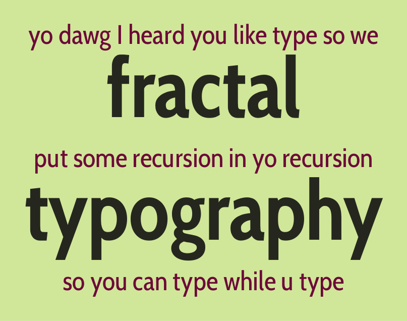
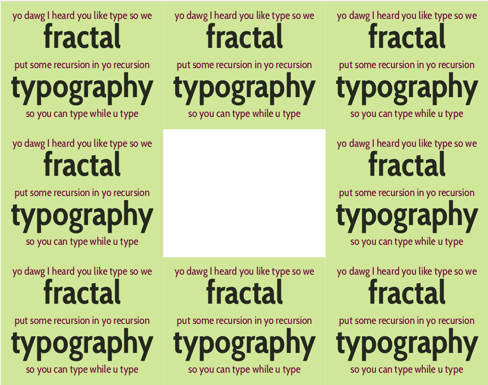
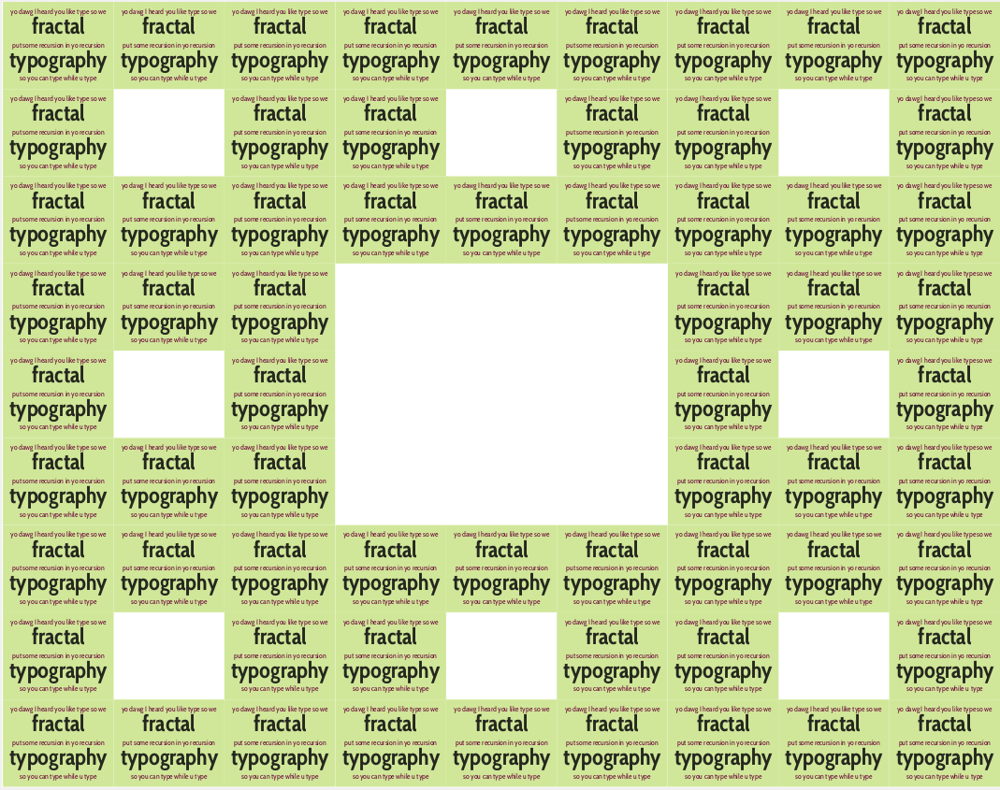
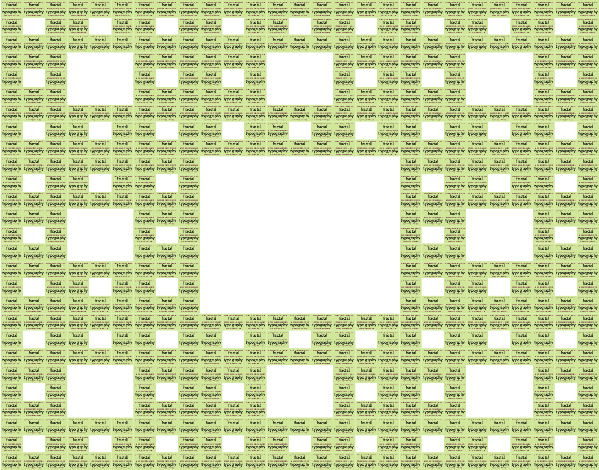
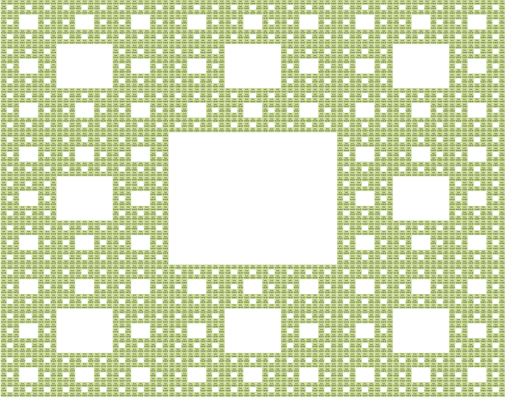

# Fractal typography

This project implements a [Sierpinski carpet](https://en.wikipedia.org/wiki/Sierpinski_carpet) using LaTeX. 

To start, install `pdflatex` and `pdfcrop` and run

    python build_recursion.py

It first compiles the "source" image. 
You can make your custom image by modifying [source.tex](source.tex). 
Next to implements the Sierpinski ["template"](table.tex)

    \newcommand{\A}{\includegraphics[width=50cm]{pdf/source.pdf}}

    ...

    \begin{tabular}{lll}
    \A & \A & \A\\
    \A &    & \A\\
    \A & \A & \A
    \end{tabular}

and rebuilds each level by reusing the previous compilation. 
A few iterations (1,2,3,4,5, and 999) can be found in the [pdf directory](pdf).

## Examples

**Level 1** (source image)

**Level 2** (8 copies)

**Level 3** (512 copies)

**Level 4** (4096 copies)

**Level 5** (3276 copies)

---------

**Level 999** (8^999 copies)
[Good luck!](pdf/level_999.pdf)

